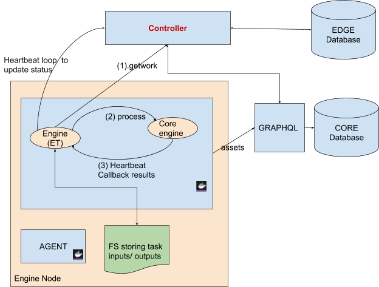

<!-- markdownlint-disable -->

# Engines

## Engine Types

Veritone engine types are: `chunk`, `stream`, and `batch`.  The runtime of the engines can be via Docker for traditional engines built in Developer, or [Node-RED](https://nodered.org/) for engines built in Automate Studio.

See the following table for the differencs between the engine types.

Chunk | Stream | Batch
 -- | -- | --
Processes a chunk at a time, producing vtn-standard outputs which are then aggregated by Output Writer to produce engine results for the task.<br/><br/>The chunks are normally the outputs of a parent task (e.g. Stream Ingestor splitting a stream into chunks of wav files), and can be processed in any order and by multiple engine instances to produce a quicker result. | Receives stream input from either an external source or a parent task, may produce vtn-standard outputs as the stream is processed, or other stream data (e.g. Stream Ingestor).<br/><br/>The engine needs the data in a single context to avoid losing accuracy or incurring complexity. For example, tracking objects across frames would be easier in a single stream than collating them across multiple chunks. | May not consume any input data from a parent task of the job.  However, it typically uses the payload for the task to perform the business logic, and outputs often produced directly into the container TDO.<br/><br/>Batch engines are typically associated with V1F (Iron-based) engines.


## Engine Toolkit

Engine Toolkit (ET) abstracts the input/output layer between the Engine and Veritone platform, freeing engine developers of having to deal with the nuances of getting input data (e.g. from queues) and producing the engine outputs (e.g. back to queue).

## New Engine Toolkit

1.  Backward compatible -- For chunk engines and other current functionality as described in Veritone docs.

2.  Unified protocol -- The new version of Engine Toolkit strives to provide support to all engine types - keeping the interface consistent so that the choice of implementing chunk, stream, or batch shouldn't be depending on how engines should get their data.

## V3F Framework

The figure below shows at a high level the V3 Framework (V3F), which is where Engine Toolkit makes requests to Controller for work. The requests are made on behalf of the engines that the Engine Toolkit represents, including native engines such as Webstream Adaptor, TV&Radio, Stream Ingestors and Output Writer.



Controller queries the database for tasks that are assigned to the engines, formulates the task IO information and assigns work requests, batches of work items, back to Engine Toolkit.

For each work item in the work request, Engine Toolkit:

1.  Retrieves the input data from the filesystem (FS) for the tasks.

2.  Invokes the core engine's `/process` webhook.

3.  Stores the result back to the filesystem for the next task.

Engine Toolkit also has a heartbeat loop  to report back to Controller the work item progress: number of processed chunks, errors, etc.

There is a RunTimeTTL set by Controller as directive to Engine Toolkit to terminate when the time is up. In addition, Controller may issue a `terminate` action as a response to the `getWork` request.

Note that besides the databases, the File System contains the state of jobs/tasks as work is being done: processed chunks, in-processing chunks, or error chunks.  The input/output relationship between tasks is specified in the Edge database and represented in the file system accordingly. For engines to emit input/output chunks or streams, the interaction with the File System should be done by Engine Toolkit to ensure correctness. To learn more about the File System, see [File System [Edge 3.0 Subsystems]](overview/aiWARE-in-depth/file-system).

## Native Engines in Engine Toolkit

Engine Toolkit for V3F includes a number of native engines such as Webstream Adapter, TV & Radio Adapter, Stream Ingestors (various flavors), and Output Writer. This provides the flexibility to turn any engine instances into "super-workers," helping to push data through the initial ingestion pipeline as well as to finalize the engine outputs.

To activate the adapters or stream ingestors, it is recommended that the Docker image containing the Engine Toolkit binary should have `ffmpeg` and `streamlink` included. <!-- INTERNAL Internal engines built by Veritone engineers should include these applications and add them to the system path if not installed properly (e.g. via apt-get or apk add). -->


**Engine IDs:**

1.  Web stream adaptor (engineId:9e611ad7-2d3b-48f6-a51b-0a1ba40feab4)

2.  TV & Radio adaptor (engineId: 74dfd76b-472a-48f0-8395-c7e01dd7fd24)

3.  Stream Ingestor v2 for playback (engineId:352556c7-de07-4d55-b33f-74b1cf237f25 )

4.  Stream Ingestor v2 for asset creation (engineId: 75fc943b-b5b0-4fe1-bcb6-9a7e1884257a)

5.  Stream Ingestor v2 for FFMPEG (engineId: 8bdb0e3b-ff28-4f6e-a3ba-887bd06e6440)

6.  OutputWriter (engineId: 8eccf9cc-6b6d-4d7d-8cb3-7ebf4950c5f3)

For more details, see the [Stream Ingestor v2](overview/aiWARE-in-depth/stream-ingestor) doc.

## Engine Interaction with Engine Toolkit in V3F

Chunk engines continue to provide the `/process` webhook endpoint as documented currently ([link](https://docs.veritone.com/#/developer/engines/toolkit/)). The input chunk is provided in the `cacheUri` parameter.  The chunk result can be on the same response back for the `/process`, OR can be asynchronous at a later time. In the latter case, chunk engines act like stream for one chunk.

Stream engines should also provide the `/process` webhook endpoint. Its input data will also be from cacheURI, and produces either vtn-standard or other format as task outputs back to ET using the heartbeat/callback endpoint.  Naturally, stream engines will respond almost immediately in handling the `/process` webhook, providing some ACK on the response or other informative response to ET.

Batch engines are similarly invoked and are required to provide heartbeats back to ET for status update with completion status.  Batch engines can be used to perform their own business logics, and produce the results in a free form fashion, e.g., producing assets directly to the TDO associated with the job that the task is in. However, they can also produce task outputs for downstream tasks in the job by following the pattern of chunk or stream engines -- producing output results by posting back to ET's /callback endpoint.  Naturally, this should be set up as part of the job DAG with output of the engine defined in the task routes and IOs.

See the [Engine Toolkit](developer/engines/toolkit/?id=engine-developers-toolkit) documentation for more details about ET implementation and required webhooks.

## Converting V2F Engines to V3F

Chunk Engines that already use the Engine Toolkit and thus do not have any direct interaction with Kafka: It's an easy process. Just pick up the latest distribution of the Engine Toolkit.

Stream Engines need to be updated to move away from consuming directly from Kafka. Think of a stream engine as a chunk engine processing just a single chunk. The payload would come from the `payload` field in the post request to the `/process` webhook (vs. PAYLOAD_JSON env variable in V2F). The heartbeats should be converted to post to the callback endpoint with the appropriate payload.


From V2F | Converting to V3F
-- | --
Upon start up, read PAYLOAD_JSON for job info | Need to provide 2 webhooks :  `/readyz` and `/process` - set environment variables accordingly ([See documentation](https://docs.veritone.com/#/developer/engines/toolkit/?id=webhook-environment-variables)).  Job information is in the `payload` field of the /process request
Read input stream from Kafka | Read input stream from the `cacheURI` which is set in the POST request to /process webhook
Output results to Kafka | Post the result to the resultWebhook of Engine Toolkit.  See [Result Webhook (from Engine Toolkit)](overview/aiWARE-in-depth/engines?id=result-webhook-from-engine-toolkit)
Heartbeat to Kafka | Post heartbeat message to the heartbeatWebhook of Engine Toolkit.  See [Heartbeat Webhook (from EngineToolkit)](overview/aiWARE-in-depth/engines?id=heartbeat-webhook-from-enginetoolkit)

Batch Engines should provide the `/process` webhook, similarly to stream engines. The payload to the engine is available in the request to the webhook.  The batch engine SHOULD NOT update task status or output directly. Heartbeats should be provided by posting back to the `/callback` endpoint from ET

From V2F | Converting to V3F
-- | --
Upon start up, read PAYLOAD_JSON for job info | Need to provide 2 webhooks :  `/readyz` and `/process` - set environment variables accordingly ([See documentation](https://docs.veritone.com/#/developer/engines/toolkit/?id=webhook-environment-variables)).  Job information is in the `payload` field of the /process request
Update Task Status to running or complete | Do not update task status back to core.  Instead submit heartbeat message to the heartbeatWebhook of Engine Toolkit.  See [Heartbeat Webhook (from EngineToolkit)](overview/aiWARE-in-depth/engines?id=heartbeat-webhook-from-enginetoolkit)


## Engine Toolkit Docker image

Engine Toolkit is available as a Docker image.  To include the Engine Toolkit in your engine Docker, use [multi-stage build](https://docs.docker.com/develop/develop-images/multistage-build/), and copy the toolkit binary to a specific location in your image.  Here is a sample Dockerfile snippet:

```pre

FROM veritone/aiware-engine-toolkit as vt-engine-toolkit

FROM YOUROWN_DOCKER_IMAGE

COPY --from=vt-engine-toolkit /opt/aiware/engine /opt/aiware/engine

ENTRYPOINT ["/opt/aiware/engine", "YOUR_ENGINE_BINARY"]

```

NOTES:

1. Refreshing the Engine Toolkit:  Make sure the docker image is refreshed by doing a `docker pull veritone/aiware-engine-toolkit` prior to your `docker build`. For a local aiWARE environment, it is best to pull before building.
  
Using Engine Toolkit in an Alpine-based image:  To use Engine Toolkit with an alpine image, make sure to include this in the Dockerfile:

`RUN apk add --no-cache libc6-compat`

## Controller / Engine Toolkit / Node Red engine relationship

For Node-RED engines in V3F, the runtime logic is provided by a single Docker image (node-red-runner) -- which needs the `ENGINE_ID` + runtime definition associated with a build when the container is started.  The difference between Node-RED Engines and other engines is:

1. A column exists in the `edge.build` table to hold the build runtime -- which is where the runtime definition is stored.  Controller will retrieve the runtime JSON of a build (via GraphQL) and store that in this column.

2. When Controller asks an agent to start an engine, the runtime JSON needs to be given as well.
 
3. Agent on the engine node will start the container with the given `dockerImage` (in this case it should be the `node-red-runner`) with the additional behavior:

    a. Store the `buildRuntime` to a file (e.g. `/cache/engines/{engineId}/{buildId}/runtime.json`). This file will be mounted to the engine Docker container in the same location (e.g. `-v /cache/engines/{engineId}/{buildId}/runtime.json:/cache/engines/{engineId}/{buildId}/runtime.json`).
    
    b.  Set the following environment variables when starting the engine Docker container:
    
 ```pre
    AIWARE_BUILD_RUNTIME t= to the file location as set in a)
    
    ENGINE_ID = the engine id (from the HostActionLaunch)
    
    BUILD_ID = the build id (from the HostActionLaunch)
```

   c. Agent will also set the `ENGINE_ID` and `BUILD_ID` for the engine.
    
4. Engine Toolkit will be agnostic about this `AIWARE_BUILD_RUNTIME` -- the Node-RED process, however, will look for this variable -- which points to a file from which it can load the build runtime definition.

5. With this approach, the Engine Toolkit does not have to do anything special for Node-RED engines.  The same framework will work for all kinds of engines.

## Node-RED (Automate) Engine Runner in Engine Toolkit

The Node-RED (Automate) engine runner is a Docker image that has Engine Toolkit & Node-RED installed, and it acts as a proxy agent. The ENTRYPOINT for the Docker image should be `/app/engine node main.js`, where main.js is the Node-RED engine runner.

Node-RED engines are denoted with `"runtime":"nodeRed"` in their `manifest.json`.  They may have their own package requirements or custom execution environment that may take some time to install. Some optimizations could be done by having the engines execution runtime setup in a designated location in the File System, e.g., /cache/nodered/engines/{engineId}-{buildId} directory to contain scripts, JSON etc. to set up engine runtime environments.

The work item will be passed on to the Node-RED engine runner `/process` endpoint which then call into the engine's runtime execution code accordingly.

<!--
TODO: The getWork API to Controller would need to be enhanced to allow retrieving Node Red work items (e.g. need runtime parameter). 
-->


## Deep Dive: Engine Interaction with Engine Toolkit

This section gives more details about the interaction between Engine Toolkit and aiWARE infrastructure.

Discovery of Webhooks
---------------------

Engine Toolkit will use the following [environment variables](https://docs.veritone.com/#/developer/engines/toolkit/?id=webhook-environment-variables) to discover the webhooks as provided by the core engine:

```pre
ENV VERITONE_WEBHOOK_READY="http://0.0.0.0:8888/readyz"
ENV VERITONE_WEBHOOK_PROCESS="http://0.0.0.0:8888/process"
```

Process Webhook (from Engine)
-----------------------------

**Request**

Engine Toolkit invokes the webhook with the following input data in its POST payload:


name | data type | notes
-- | -- | --
chunk | File | [See documentation](https://docs.veritone.com/#/developer/engines/toolkit/?id=process-webhook) - will not be available for stream engine
chunkMimeType | string | [See documentation](https://docs.veritone.com/#/developer/engines/toolkit/?id=process-webhook)
startOffsetMS | int | [See documentation](https://docs.veritone.com/#/developer/engines/toolkit/?id=process-webhook)
endOffsetMS | int | [See documentation](https://docs.veritone.com/#/developer/engines/toolkit/?id=process-webhook)
width | int | [See documentation](https://docs.veritone.com/#/developer/engines/toolkit/?id=process-webhook)
height | int | [See documentation](https://docs.veritone.com/#/developer/engines/toolkit/?id=process-webhook)
libraryId | string | [See documentation](https://docs.veritone.com/#/developer/engines/toolkit/?id=process-webhook)
libraryEngineModelId | string | [See documentation](https://docs.veritone.com/#/developer/engines/toolkit/?id=process-webhook)
cacheURI | string | [See documentation](https://docs.veritone.com/#/developer/engines/toolkit/?id=process-webhook) - stream engine should use this to retrieve the input stream
veritoneApiBaseUrl | string | [See documentation](https://docs.veritone.com/#/developer/engines/toolkit/?id=process-webhook)
token | string | [See documentation](https://docs.veritone.com/#/developer/engines/toolkit/?id=process-webhook)
payload | JSON string | [See documentation](https://docs.veritone.com/#/developer/engines/toolkit/?id=process-webhook)
chunkContext |  string | NEW This gives some context for the result
heartbeatWebhook | string | NEW This is the heartbeat webhook provided by Engine Toolkit.  Engines with async processing for the `/process` webhook, such as stream or batch engines, should submit heartbeats with progress information.  This is the equivalent of stream engines emitting into the engine_status Kafka queue for heartbeats
resultWebhook | String  | NEW This is the result webhook provided by Engine Toolkit. The engine should submit results of the processing as soon as it could.  This is the equivalent of stream engines emitting into the chunk_all Kafka queue when it finished processing some data off the input stream.
externalCallbackWebhook | string | NEW TBD provided by Engine Toolkit.  Engines may pass on this webhook to an external entity performing the real processing
maxTTL | int | NEW the maximum  time that engine toolkit can wait for results from the engine.


**Response**

Chunk engines that produce JSON response for vtn-standard will continue to do so as [documented here](https://docs.veritone.com/#/developer/engines/toolkit/?id=process-webhook).

For stream and batch engines with async or stand-alone processing mode, it is required that the following be returned in the JSON response.  Suggested value for `estimatedProcessingTimeInSeconds` is `maxTTL` - or more if maxTTL is insufficient.  For example, if the engine is to call out to external entity for processing and thus may require more than hours to process.

name | data type | notes
-- | -- | --
estimatedProcessingTimeInSeconds | int | Amount of seconds that the engine  estimates to produce some results. First phase: any non-zero will do... 


Heartbeat Webhook (from Engine Toolkit)
--------------------------------------

Engines performing the processing asynchronously such as stream or batch engines should submit heartbeats to Engine Toolkit on a regular interval (suggested every second).  The webhook is given to the engine in the `heartbeatWebhook` field of the /process request.

**Request**

The request to the heartbeatWebhook should have the following data.

name | data type | notes
-- | -- | --
status | string (enum) | Required. Possible values: running, complete, failed
bytesRead | int64 | Optional
bytesWritten | int64 | Optional
messagesWritten | int64 | Optional  Number of results submitted thus far
infoMs | string | Optional: informational message about the running status of the engine
failureReason | String (enum) | Required when status is set to failed.  Possible values:<br/>internal_error<br/>external_error<br/>unknown<br/>url_not_found<br/>url_not_allowed<br/>url_timeout<br/>url_connection_refused<br/>url_error<br/>invalid_data<br/>rate_limited<br/>api_not_allowed<br/>api_authentication_error<br/>api_not_found<br/>api_error<br/>file_write_error<br/>stream_read_error<br/>system_dependency_missing<br/>system_error<br/>heartbeat_timeout<br/>other
failureMsg | string | Optional: supplemental info for failureReason

**Response**

`204 - No content`

Result Webhook (from Engine Toolkit)
------------------------------------

Whenever the engine has a complete unit of processed work for the task, it should submit the result back to Engine Toolkit for persistence.  The webhook is given to the engine in the `resultWebhook` field of the /process request.  See [resultWebhook](https://docs.google.com/document/d/1VC06SkIlMi-3FoqrqU3N_WGIwV7j2EmphRRSOXzbAi0/edit#bookmark=id.31uhqi2c55f5).

**Request**

The request to the resultWebhook should have the following data.

name | data type | notes
-- | -- | --
chunkContext | string | Optional. This is the value of the `chunkContext` as passed into the request of the `/process` .  It should be present if the engine is chunk engine
startOffsetMs | int64 | Optional - offset of the start of the chunk from the beginning of the input stream for which this result was produced | |
endOffsetMs | int64 | Optional - offset of the end of the chunk from the beginning of the input stream for which this result was produced
output | JSON | Required VTN-Standard of the result.  See [documentation](https://docs.veritone.com/#/developer/engines/standards/engine-output/) for engine vtn-standard output format.


For example:

```pre
POST <http://localhost:1234/result/task1234>

{ 
  "index" : 1,
  "startOffsetMs": 0,
  "endOffsetMs": 1200,
  "output" : {"series": [
    {
      "startTimeMs": 0,
      "stopTimeMs": 300,
      "words": [
        {
          "word": "this"
        }
      ]
    },
    {
      "startTimeMs": 300,
      "stopTimeMs": 500,
      "words": [
        {
          "word": "is"
        }
      ]
    },
    {
      "startTimeMs": 500,
      "stopTimeMs": 800,
      "words": [
        {
          "word": "a"
        }
      ]
    },
    {
      "startTimeMs": 800,
      "stopTimeMs": 1200,
      "words": [
        {
          "word": "sentence"
        }
      ]
    }
  ]}
}
```

**Response**

`204 - No content`

